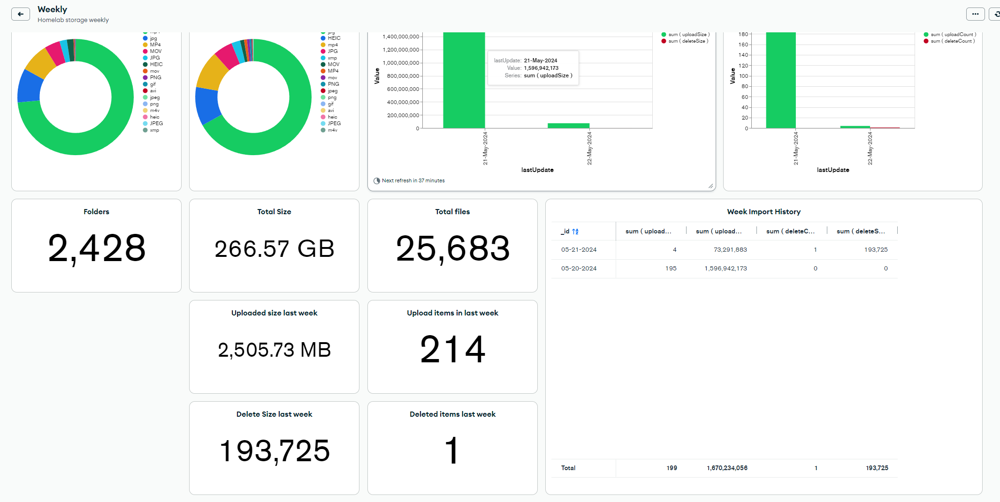

# Cloud archiver

This project was created not with the intention of breaking the self-hosted goal but to become partial self-hosted as I couln't convince my wife that all our photos and videos were safe in several disks at a personal cloud (which is a cloud in the end) so she wanted to have some "big" cloud company involved...So I decided to keep paying for cloud storage but at a very low rate instead, going from $10 month to $0.5 month (aprox) for the same files, I tried to leverage on persisting some metadata to a database in order to reduce the "hits" to the cloud provider and therefore minimize cloud service usage fees.

# My personal use

I use this project to have a very cheap cloud backup to my [immich](https://immich.app/) library (I just backup the photos not the Postgres DB or other files) as when I started this journey my lovely wife was not on board as she was always asking "why not in cloud?", "what if all your backed up disks break?"... I can't afford myself a NAS or anything better than a couple of SSDs...sooo here we are, it has worked for me as a daily running task that I scheduled on my minipc so it just pushes new files to the cloud and I get a beautiful email from [Mongo Atlas](https://account.mongodb.com/) every week, I have not needed to restore anything from could this far but I have tested my backup and files are there.

# Features

- Upload configured folders to the cloud provider bucket.
- [MongoDB Atlas](https://account.mongodb.com/) integration to track metadata allows for report creation.
    - They offer a 516MB always-free quota, which seems small but is sufficient for metadata. At the time of writing, with 25,683 registered files and 266GB of data, I was using only 7.67MB.
- Configurable sync between local locations and the cloud using cron expressions.
- Configurable delete of cloud items if they were deleted locally (disabled by default).

## Considerations

- I discovered that cloud providers impose "early delete" fees, so I configured settings to avoid these charges (I'll elaborate on this).
- I'm using the cloud provider for backup to benefit from low storage costs, despite the higher retrieval costs. I'm aware that if I need to retrieve all my backups, it will incur a substantial fee (approximately $20 to $25 at the time of writing). The alternative would be to opt for higher storage costs with no retrieval fees, but this doesn't suit my backup-only use case.

# Planned new features

- Detect file changes on local server and reflect them to the object in the cloud bucket
- Full restore from cloud (Get everything based on the bucket instead of metadata)
- Partial restore from cloud (Get specific items from the bucket leveraging on the database data)

# MongoDB

## Configure cloud provider

Current supported cloud providers and how to configure the needed objects:

- [Google Cloud Platform](./gcp/GCP-README.MD) or GCS Cloud Storage

# Support this guy

Any support will be of course appreciated, I created this [buy me a coffee](https://www.buymeacoffee.com/ringuerel) Which will be used in storage time instead ;), any support messages/ideas will do as good.