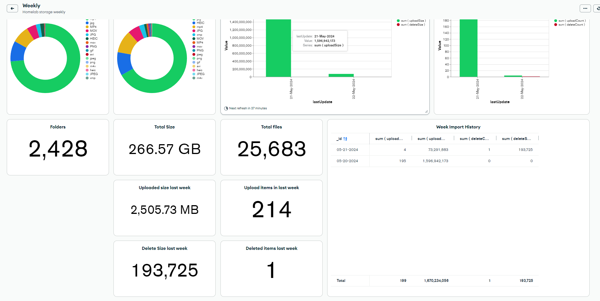

# Cloud archiver

This project was created not with the intention of breaking the self-hosted goal but to become partial self-hosted as I couldn't convince my wife that all our photos and videos were safe in several disks at a personal cloud (which is a cloud in the end) so she wanted to have some "big" cloud company involved...So I decided to keep paying for cloud storage but at a very low rate instead, going from $10 month to $0.5 month (aprox) for the same files, I tried to leverage on persisting some metadata to a database in order to reduce the "hits" to the cloud provider and therefore minimize cloud service usage fees.


PlantUML Code to the diagram is [here](./docs/sync_workflow.md)

## What it does?

- It scans the configured folders
- Identifies files that have not been uploaded to the cloud bucket and uploads them
- Identifies files that exist in the cloud bucket but also on local and have changed (file modified) and uploaads them
- When delete from cloud is enabled, deletes files from cloud bucket when file is no longer present in disk and was uploaded to the cloud bucket within the configured days *STANDARDDELETEDAYSLIMIT* or after the configured days *ARCHIVEDELETEDAYSHOLD*, this configuration must be done entirely aligned with the cloud bucket object lifecycle if any (to mitigate cloud provider fees).

# My personal use

I use this project to have a very cheap cloud backup to my [immich](https://immich.app/) library (I just backup the photos not the Postgres DB or other files...yet) as when I started this journey my lovely wife was not on board as she was always asking "why not in cloud?", "what if all your backed up disks break?"... I can't afford myself a NAS or anything better than a couple of SSDs...sooo here we are, it has worked for me as a daily running task that I scheduled on my minipc so it just pushes new files to the cloud and I get a beautiful email from [Mongo Atlas](https://account.mongodb.com/) every week, I have not needed to restore anything from could this far but I have tested my backup and files are there, so esentially I know that I pay a low fee (about $0.34 USD monthly for about 270GB by this update) for the storage of my backup but I'm also aware that when I need to restore my backup from here it will take a toll (I've estimated about $20 USD)...

So if you're considering to use this, leverage on the [GCS calculator](https://cloud.google.com/products/calculator) to have some approx values.

# Features

- Upload configured folders to the cloud provider bucket.
- [MongoDB Atlas](https://account.mongodb.com/) integration to track metadata allows for report creation.
    - They offer a 516MB always-free quota, which seems small but is sufficient for metadata. At the time of writing, with 25,683 registered files and 266GB of data, I was using only 7.67MB.
- Configurable sync between local locations and the cloud using cron expressions.
- Configurable delete of cloud items if they were deleted locally (disabled by default).
- Retrieve archived files by date range: A new endpoint `/file-catalog/archived-range` allows fetching `FileCatalogItem`s based on their `archiveDate` within a specified `startDate` and `endDate` (format: `YYYY-MM-DD`). An optional `path` parameter can be provided to filter results where `absolutePath` starts with the given path.
- **NEW:** Download files from GCP by specifying a cloud path. The application will restore the file to a local folder configured by `downloadsRoot`, preserving the relative path structure. Missing folders will be created automatically.

## Download from GCP

You can now restore files from your GCP bucket by providing the cloud path. The restored file will be placed under the configured `downloadsRoot` directory, maintaining its relative path. Any necessary parent directories will be created automatically.

### Configuration

Add the following property to your configuration (e.g., `application.yml` or environment variables):

```yaml
downloadsRoot: /home/user/downloads
```

This is the root directory where restored files will be placed.

# API Endpoints

This section details the REST endpoints available in the Cloud Archiver application.

## Swagger UI
The API documentation can be accessed via Swagger UI at: `http://host:8080/cloud-archiver/swagger-ui/index.html`

## GET /file-catalog
*   **Description:** Retrieves a list of `FileCatalogItem`s by searching for a file name.
*   **Parameters:** `fileName` (String, required) - The name or part of the name of the file to search for.
*   **Example Usage:** `GET /file-catalog?fileName=myphoto`

## GET /file-catalog/similar
*   **Description:** Retrieves a list of `FileCatalogItem`s that have similar file names.
*   **Parameters:** `fileName` (String, required) - The file name to find similar entries for.
*   **Example Usage:** `GET /file-catalog/similar?fileName=document`

## GET /file-catalog/archived-range
*   **Description:** Retrieves a list of `FileCatalogItem`s archived within a specified date range, with an optional path filter.
*   **Parameters:**
    *   `startDate` (String, required) - The start date in `YYYY-MM-DD` format.
    *   `endDate` (String, required) - The end date in `YYYY-MM-DD` format.
    *   `path` (String, optional) - An optional path to filter results where `absolutePath` starts with the given path.
*   **Example Usage:** `GET /file-catalog/archived-range?startDate=2023-01-01&endDate=2023-12-31&path=/photos/vacation`

## POST /file-catalog/download
*   **Description:** Initiates the download of a file from the cloud to a local `downloadsRoot` directory, preserving the relative path structure.
*   **Parameters:** `path` (String, required) - The cloud path of the file to download.
*   **Example Usage:** `POST /file-catalog/download?path=/home/user/test2/Authelia123.md`

## POST /file-catalog/sync
*   **Description:** This endpoint is currently unsupported and will be available in future versions.

### Example Docker Compose

Add the following environment variable to your Docker Compose file:

```yaml
# ...existing code...
  cloud-archiver:
    image: your-cloud-archiver-image
    environment:
      # ...existing code...
      DOWNLOADS_ROOT: /home/user/downloads
    # ...existing code...
```

## Considerations

- I discovered that cloud providers impose "early delete" fees, so I configured settings to avoid these charges (I'll elaborate on this).
- I'm using the cloud provider for backup to benefit from low storage costs, despite the higher retrieval costs. I'm aware that if I need to retrieve all my backups, it will incur a substantial fee (approximately $20 to $25 at the time of writing). The alternative would be to opt for higher storage costs with no retrieval fees, but this doesn't suit my backup-only use case.

# Planned new features

- Full restore from cloud (Get everything based on the bucket instead of metadata)
- Partial restore from cloud (Get specific items from the bucket leveraging on the database data)
- **Download files from GCP by path (new)**

# MongoDB

Requires you to create 2 new collections:

- *file_catalog*: Where the files and metadata will be indexed
- *sync_summary*: Uploads/deletes summary grouped by day

## Mongo Atlas

MongoDB Atlas is a fully-managed cloud database that handles all the complexity of deploying, managing, and healing your deployments on the cloud service provider of your choice (AWS , Azure, and GCP). MongoDB Atlas is the best way to deploy, run, and scale MongoDB in the cloud.


*NOTE*: If you want to use this with your owon mongo instance this application should also work, just to be clear none of the above graphics will be available.

### Configure Mongo Atlas

- [Mongo Atlas](./mongo-atlas/MONGO-ATLAS-README.MD)


# Configure cloud provider

Current supported cloud providers and how to configure the needed objects:

- [Google Cloud Platform](./gcp/GCP-README.MD) or GCS Cloud Storage

# Adding New Features with Gitflow Maven Plugin

To add a new feature using the gitflow-maven-plugin, follow these steps:

1. Make sure your local repository is up to date with `develop`.
2. Start a new feature branch:
    ```
    mvn gitflow:feature-start -DfeatureName=your-feature-name
    ```
3. Implement your changes and commit them to the feature branch.
4. When your feature is complete, finish the feature:
    ```
    mvn gitflow:feature-finish
    ```
5. Push your changes to the remote repository:
    ```
    git push --all
    ```

# Release Process

This project uses the **gitflow-maven-plugin** to manage releases. To create a release, follow these steps:

1. Make sure your local repository is up to date with `develop` and `main`.
2. Run the following command to start a release:
    ```
    mvn gitflow:release-start
    ```
3. Update version numbers and commit changes as prompted.
4. Finish the release with:
    ```
    mvn gitflow:release-finish
    ```
5. Push the changes and tags to the remote repository:
    ```
    git push --all && git push --tags
    ```

For more details, see the [gitflow-maven-plugin documentation](https://github.com/aleksandr-m/gitflow-maven-plugin).

# Continuous Integration & Docker Image Build

Whenever changes are pushed to the `develop` branch, GitHub Actions workflows automatically build the project and create a Docker image. This ensures that the latest development version is always available as a Docker image for

# Docker compose

[Here's an example docker compose file](./docker/cloud-archiver.yml)

# Support this guy

Any support will be of course appreciated, (In fact I did not end the setup for support...but still get ideas) , any support messages/ideas will do as good.
