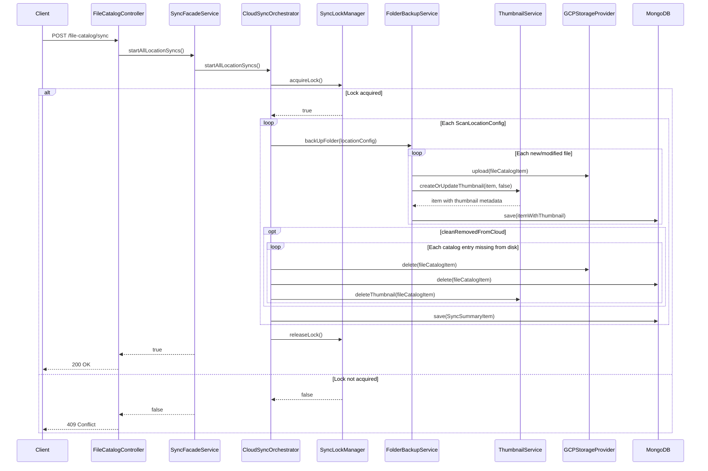

# REST API Reference

Base path: `/cloud-archiver`  
Default port: `8080`  
Interactive docs: `http://localhost:8080/cloud-archiver/swagger-ui/index.html`

## Controllers

| Controller | Base path | Responsibility |
|------------|-----------|----------------|
| `FileCatalogController` | `/cloud-archiver/file-catalog` | Catalog queries, download, sync trigger |
| `ThumbnailController` | `/cloud-archiver/thumbnails` | Thumbnail rebuild operations |

---

## Endpoints

### GET `/file-catalog`

Search the catalog by exact (case-sensitive) filename substring.

| Parameter | Type | Required | Description |
|-----------|------|----------|-------------|
| `fileName` | string | yes | Substring to match against `fileName` field |

**Response** `200 OK` — array of `FileCatalogItem`

```json
[
  {
    "absolutePath": "/immich/library/user/2024/photo.jpg",
    "fileName": "photo.jpg",
    "fileExtension": "jpg",
    "parentFolder": "/immich/library/user/2024",
    "isDirectory": false,
    "fileSize": 3145728,
    "archiveDate": "2024-03-15T10:22:00.000+00:00",
    "crc32c": "abc123==",
    "lastModified": "2024-03-14T18:00:00Z"
  }
]
```

---

### GET `/file-catalog/similar`

Case-insensitive filename substring search.

| Parameter | Type | Required | Description |
|-----------|------|----------|-------------|
| `fileName` | string | yes | Substring to match (case-insensitive) |

**Response** `200 OK` — array of `FileCatalogItem`

---

### GET `/file-catalog/archived-range`

Find files archived within a date range, optionally filtered by path prefix.

| Parameter | Type | Required | Description |
|-----------|------|----------|-------------|
| `startDate` | string | yes | `yyyy-MM-dd` |
| `endDate` | string | yes | `yyyy-MM-dd` |
| `path` | string | no | Absolute path prefix to filter results |

**Response** `200 OK` — array of `FileCatalogItem`  
**Response** `400 Bad Request` — invalid date format

---

### POST `/file-catalog/download`

Download a file or folder from the cloud provider to the configured `downloadRoot`.

| Parameter | Type | Required | Description |
|-----------|------|----------|-------------|
| `path` | string | yes | Cloud object path. Trailing `/` downloads a folder prefix. |

**Response** `200 OK` — `"Download started for: <path>"`  
**Response** `500 Internal Server Error` — `"Download failed for: <path>"`

**Example — restore a single file:**
```
POST /cloud-archiver/file-catalog/download?path=/home/user/photos/vacation.jpg
```

**Example — restore a folder prefix:**
```
POST /cloud-archiver/file-catalog/download?path=/home/user/photos/2024/
```

Files are placed under `downloadRoot`, preserving their relative path. Missing intermediate directories are created automatically.

> **Note:** `downloadRoot` must be configured in `application.yml` or via the `APPLICATION_DOWNLOADROOT` environment variable.

---

### GET `/file-catalog/pending-deletion`

Returns catalog items that exist in MongoDB but whose file no longer exists on disk — files deleted locally that are still within their cloud retention window. Each result is enriched with the number of days remaining before the item becomes eligible for cloud deletion.

All parameters are optional and combinable.

| Parameter | Type | Required | Description |
|-----------|------|----------|-------------|
| `fileNameContains` | string | no | Case-insensitive substring match against `fileName` |
| `fileNameExact` | string | no | Exact match against `fileName` |
| `path` | string | no | Restrict to entries whose `absolutePath` starts with this prefix |

> `fileNameContains` and `fileNameExact` are mutually exclusive — if both are provided, `fileNameContains` takes precedence.

**Response** `200 OK` — array of `PendingDeletionItem`

```json
[
  {
    "catalogItem": {
      "absolutePath": "/immich/library/user/2024/photo.jpg",
      "fileName": "photo.jpg",
      "fileExtension": "jpg",
      "parentFolder": "/immich/library/user/2024",
      "isDirectory": false,
      "fileSize": 3145728,
      "archiveDate": "2024-03-15T10:22:00.000+00:00",
      "crc32c": "abc123==",
      "lastModified": "2024-03-14T18:00:00Z"
    },
    "daysUntilDeletion": 15,
    "scanFolder": "/immich/library/"
  }
]
```

**`daysUntilDeletion` semantics:**

| Value | Meaning |
|-------|---------|
| Positive | Days remaining before the item is eligible for cloud deletion |
| `0` | Eligible today, or `archiveDate`/`standardDeleteDaysLimit` not configured |
| Negative | Already past the eligibility date but cleanup hasn't run yet |

**Examples:**
```
# All files deleted locally but still held in cloud
GET /cloud-archiver/file-catalog/pending-deletion

# Filter by partial name
GET /cloud-archiver/file-catalog/pending-deletion?fileNameContains=vacation

# Filter by exact name under a specific path
GET /cloud-archiver/file-catalog/pending-deletion?fileNameExact=photo.jpg&path=/immich/library/user/
```

---

### POST `/file-catalog/sync`

Trigger a full sync of all configured scan locations immediately (same logic as the scheduled cron job).

**Response** `200 OK` — `"Sync process initiated successfully."`  
**Response** `409 Conflict` — `"Sync process skipped: another sync is already running."`

> **Stale lock:** If a previous sync crashed without releasing the lock, it will be force-released after `application.syncLockTimeoutSeconds` (default: 3600 s). The next call after that timeout will proceed normally.

---

### POST `/thumbnails/rebuild`

Create or refresh local thumbnail metadata for existing catalog entries without re-uploading original files.

> **Base path change:** This endpoint moved from `/file-catalog/thumbnails/rebuild` to `/thumbnails/rebuild` as part of the orchestration isolation refactor.

| Parameter | Type | Required | Default | Description |
|-----------|------|----------|---------|-------------|
| `mode` | string | no | `MISSING_ONLY` | `MISSING_ONLY`, `FAILED_ONLY`, or `FORCE` |
| `path` | string | no | — | Restrict to entries whose path starts with this prefix |
| `fileNameContains` | string | no | — | Case-insensitive substring match against `fileName` |
| `limit` | integer | no | `application.thumbnails.rebuild.defaultLimit` | Maximum number of entries to process |
| `concurrency` | integer | no | `application.thumbnails.rebuild.maxConcurrency` | Maximum parallel thumbnail workers for this request, clamped between 1 and 16 |

**Examples:**

```
POST /cloud-archiver/thumbnails/rebuild?mode=MISSING_ONLY&path=/immich/library
POST /cloud-archiver/thumbnails/rebuild?mode=FAILED_ONLY&limit=100&concurrency=4
POST /cloud-archiver/thumbnails/rebuild?mode=FORCE&fileNameContains=jpg
```

**Response** `200 OK`

```json
{
  "mode": "MISSING_ONLY",
  "processedCount": 42,
  "createdCount": 40,
  "skippedCount": 1,
  "failedCount": 1
}
```

---

## Error Handling

Global exception handler (`FileCatalogResponseEntityExceptionHandler`):

| Exception | HTTP Status |
|-----------|-------------|
| `CloudBackupException` | `409 Conflict` |
| `IllegalArgumentException` | `400 Bad Request` |

---

## Sequence: Manual Sync via REST


