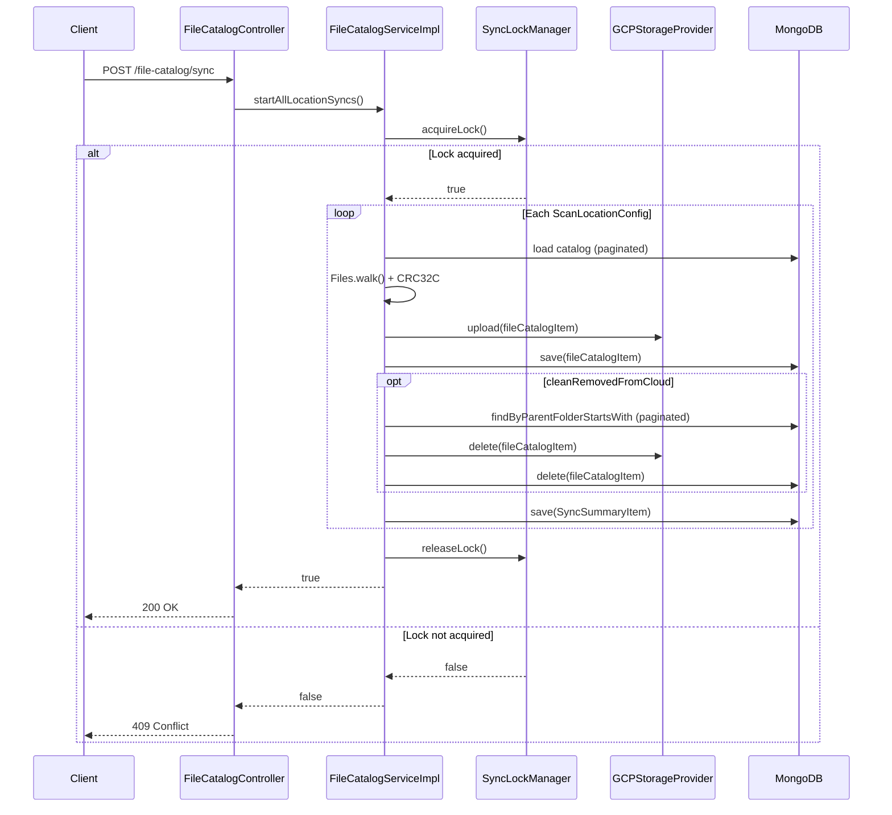

# REST API Reference

Base path: `/cloud-archiver/file-catalog`  
Default port: `8080`  
Interactive docs: `http://localhost:8080/cloud-archiver/swagger-ui/index.html`

---

## Endpoints

### GET `/file-catalog`

Search the catalog by exact (case-sensitive) filename substring.

| Parameter | Type | Required | Description |
|-----------|------|----------|-------------|
| `fileName` | string | yes | Substring to match against `fileName` field |

**Response** `200 OK` — array of `FileCatalogItem`

```json
[
  {
    "absolutePath": "/immich/library/user/2024/photo.jpg",
    "fileName": "photo.jpg",
    "fileExtension": "jpg",
    "parentFolder": "/immich/library/user/2024",
    "isDirectory": false,
    "fileSize": 3145728,
    "archiveDate": "2024-03-15T10:22:00.000+00:00",
    "crc32c": "abc123==",
    "lastModified": "2024-03-14T18:00:00Z"
  }
]
```

---

### GET `/file-catalog/similar`

Case-insensitive filename substring search.

| Parameter | Type | Required | Description |
|-----------|------|----------|-------------|
| `fileName` | string | yes | Substring to match (case-insensitive) |

**Response** `200 OK` — array of `FileCatalogItem`

---

### GET `/file-catalog/archived-range`

Find files archived within a date range, optionally filtered by path prefix.

| Parameter | Type | Required | Description |
|-----------|------|----------|-------------|
| `startDate` | string | yes | `yyyy-MM-dd` |
| `endDate` | string | yes | `yyyy-MM-dd` |
| `path` | string | no | Absolute path prefix to filter results |

**Response** `200 OK` — array of `FileCatalogItem`  
**Response** `400 Bad Request` — invalid date format

---

### POST `/file-catalog/download`

Download a file or folder from the cloud provider to the configured `downloadRoot`.

| Parameter | Type | Required | Description |
|-----------|------|----------|-------------|
| `path` | string | yes | Cloud object path. Trailing `/` downloads a folder prefix. |

**Response** `200 OK` — `"Download started for: <path>"`  
**Response** `500 Internal Server Error` — `"Download failed for: <path>"`

> **Note:** `downloadRoot` must be configured in `application.yml` or via the `APPLICATION_DOWNLOADROOT` environment variable.

---

### POST `/file-catalog/sync`

Trigger a full sync of all configured scan locations immediately (same logic as the scheduled cron job).

**Response** `200 OK` — `"Sync process initiated successfully."`  
**Response** `409 Conflict` — `"Sync process skipped: another sync is already running."`

---

## Error Handling

Global exception handler (`FileCatalogResponseEntityExceptionHandler`):

| Exception | HTTP Status |
|-----------|-------------|
| `CloudBackupException` | `409 Conflict` |
| `IllegalArgumentException` | `400 Bad Request` |

---

## Sequence: Manual Sync via REST


