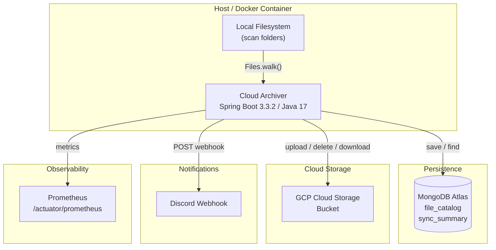
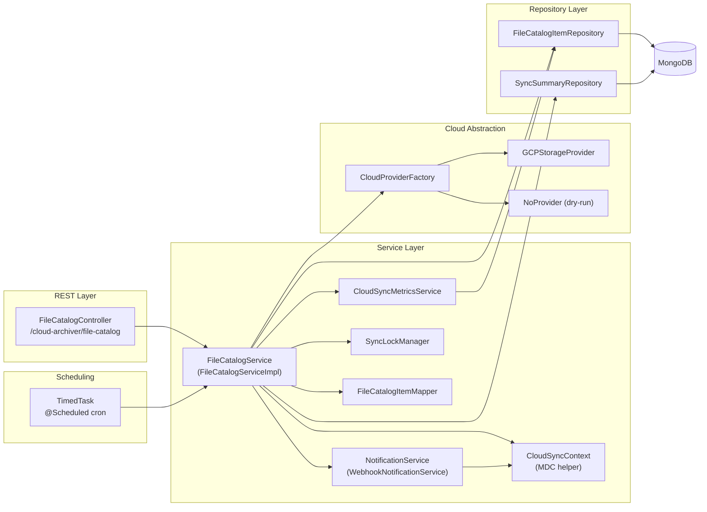
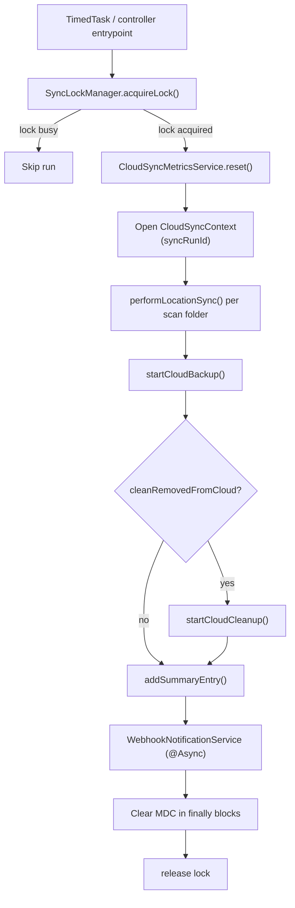

# Cloud Archiver — Architecture

## Overview

Cloud Archiver is a self-hosted Spring Boot service that continuously synchronizes local folders to a cloud storage bucket. It tracks every file in a MongoDB catalog, computes CRC32C checksums to detect changes, uploads new or modified files, and optionally removes cloud objects when the local file is deleted — respecting configurable retention windows to avoid early-deletion fees on cold storage classes.



---

## Layer Diagram



---

## Sync Execution Flow



---

## Package Structure

```
com.homelab.ringue.cloud.archiver
├── CloudArchiverApplication.java       Entry point
├── config/
│   ├── ApplicationProperties.java      @ConfigurationProperties binding
│   └── SwaggerConfig.java              OpenAPI / Swagger UI setup
├── controller/
│   ├── FileCatalogController.java      REST endpoints
│   └── FileCatalogResponseEntityExceptionHandler.java  Global error handler
├── cloudprovider/
│   ├── CloudProvider.java              Interface: upload / delete / download / getCheckSum
│   ├── CloudProviderFactory.java       Selects provider by enum key
│   ├── CloudProviders.java             Enum: GCP | NO_PROVIDER
│   └── impl/
│       ├── GCPStorageProvider.java     Google Cloud Storage implementation
│       └── NoProvider.java             Dry-run / test implementation
├── domain/
│   ├── FileCatalogItem.java            MongoDB document (file_catalog)
│   └── SyncSummaryItem.java            MongoDB document (sync_summary)
├── exception/
│   ├── CloudBackupException.java       Checked — backup failure
│   └── CloudDeleteFailedException.java Runtime — cloud delete failure
├── repository/
│   ├── FileCatalogItemRepository.java  MongoRepository for file catalog
│   └── SyncSummaryRepository.java      MongoRepository for daily summaries
└── service/
    ├── CloudSyncContext.java           MDC helper for sync, cleanup, summary, and download phases
    ├── CloudSyncMetrics.java           Meter bundle used during sync execution
    ├── CloudSyncMetricsService.java    Shared metric registration/reset ownership
    ├── FileCatalogService.java         Service interface
    ├── FileCatalogItemMapper.java      Mapper interface
    ├── NotificationService.java        Notification interface
    ├── SyncLockManager.java            Concurrency lock
    ├── TimedTask.java                  Scheduled trigger
    ├── impl/
    │   ├── CloudSyncMetricsServiceImpl.java  Metric registry lifecycle manager
    │   ├── FileCatalogServiceImpl.java Core business logic
    │   ├── FileCatalogItemMapperImpl.java  Path → domain object mapping
    │   └── WebhookNotificationService.java Discord webhook sender
    └── notification/
        ├── WebhookPayload.java         Webhook request body
        ├── Embed.java                  Discord embed object
        └── Field.java                  Discord embed field
```

---

## Design Patterns

| Pattern | Where used | Purpose |
|---------|-----------|---------|
| **Strategy** | `CloudProvider` / `GCPStorageProvider` / `NoProvider` | Swap cloud backends without changing business logic |
| **Factory** | `CloudProviderFactory` | Resolve the correct `CloudProvider` by `CloudProviders` enum at runtime |
| **Repository** | `FileCatalogItemRepository`, `SyncSummaryRepository` | Decouple data access from service logic |
| **Observer / async** | `WebhookNotificationService` (`@Async`) | Notifications fire and forget — don't block the sync thread |
| **Context object** | `CloudSyncContext` | Carry stable MDC fields across sync, cleanup, summary, and async notification boundaries |
| **Prototype scope** | `FileCatalogServiceImpl`, `FileCatalogController` | Fresh instance per injection point; mutable counters stay per-run while shared metric ownership moves out of the prototype bean |
