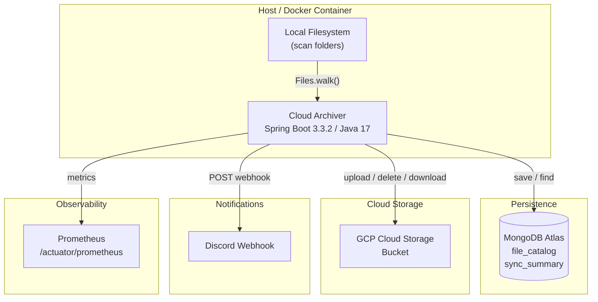
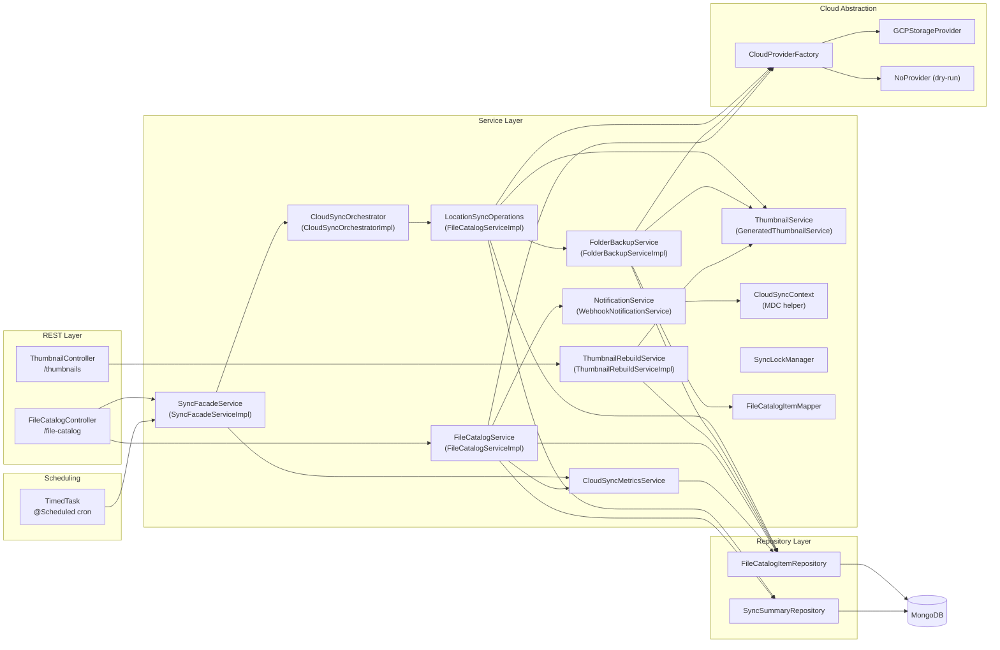
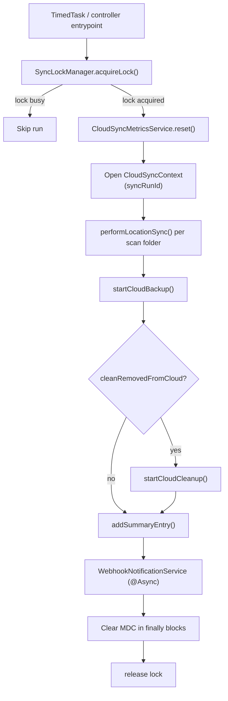

# Cloud Archiver — Architecture

## Overview

Cloud Archiver is a self-hosted Spring Boot service that continuously synchronizes local folders to a cloud storage bucket. It tracks every file in a MongoDB catalog, computes CRC32C checksums to detect changes, uploads new or modified files, and optionally removes cloud objects when the local file is deleted — respecting configurable retention windows to avoid early-deletion fees on cold storage classes.



---

## Layer Diagram



---

## Sync Execution Flow



---

## Package Structure

```
com.homelab.ringue.cloud.archiver
├── CloudArchiverApplication.java       Entry point
├── config/
│   ├── ApplicationProperties.java      @ConfigurationProperties binding
│   └── SwaggerConfig.java              OpenAPI / Swagger UI setup
├── controller/
│   ├── FileCatalogController.java      Catalog queries, download, sync trigger
│   ├── ThumbnailController.java        Thumbnail rebuild endpoint
│   └── FileCatalogResponseEntityExceptionHandler.java  Global error handler
├── cloudprovider/
│   ├── CloudProvider.java              Interface: upload / delete / download / getCheckSum
│   ├── CloudProviderFactory.java       Selects provider by enum key
│   ├── CloudProviders.java             Enum: GCP | NO_PROVIDER
│   └── impl/
│       ├── GCPStorageProvider.java     Google Cloud Storage implementation
│       └── NoProvider.java             Dry-run / test implementation
├── domain/
│   ├── FileCatalogItem.java            MongoDB document (file_catalog)
│   ├── PendingDeletionItem.java        DTO: catalog item + days-until-deletion
│   ├── SyncSummaryItem.java            MongoDB document (sync_summary)
│   ├── ThumbnailRebuildMode.java       Enum: MISSING_ONLY | FAILED_ONLY | FORCE
│   ├── ThumbnailRebuildSummary.java    DTO: rebuild result counts
│   └── ThumbnailStatus.java            Enum: CREATED | SKIPPED | FAILED
├── exception/
│   ├── CloudBackupException.java       Checked — backup failure
│   └── CloudDeleteFailedException.java Runtime — cloud delete failure
├── repository/
│   ├── FileCatalogItemRepository.java  MongoRepository for file catalog
│   └── SyncSummaryRepository.java      MongoRepository for daily summaries
└── service/
    ├── BackupPipelineContext.java      Record: upload counters + catalog cache
    ├── CloudSyncContext.java           MDC helper for sync phases
    ├── CloudSyncMetrics.java           Meter bundle used during sync execution
    ├── CloudSyncMetricsService.java    Metric registration/reset ownership
    ├── CloudSyncOrchestrator.java      Orchestrates per-location sync execution
    ├── FileCatalogItemMapper.java      Mapper interface
    ├── FileCatalogService.java         Catalog query and download interface
    ├── FolderBackupService.java        Backup pipeline interface
    ├── LocationSyncOperations.java     executeBackup / executeCleanup / persistSummary
    ├── NotificationService.java        Notification interface
    ├── SyncFacadeService.java          Thin sync trigger: delegates to CloudSyncOrchestrator
    ├── SyncLockManager.java            Concurrency lock
    ├── ThumbnailRebuildService.java    Rebuild orchestration interface
    ├── ThumbnailService.java           Thumbnail create / delete interface
    ├── TimedTask.java                  Scheduled trigger (uses SyncFacadeService)
    ├── impl/
    │   ├── CloudSyncMetricsServiceImpl.java    Metric registry lifecycle manager
    │   ├── CloudSyncOrchestratorImpl.java      Per-location sync orchestrator
    │   ├── FileCatalogItemMapperImpl.java      Path → domain object mapping
    │   ├── FileCatalogServiceImpl.java         Catalog queries, download, LocationSyncOperations
    │   ├── FolderBackupServiceImpl.java        Scan/import pipeline + thumbnail wiring
    │   ├── GeneratedThumbnailService.java      Java2D image thumbnail generation
    │   ├── SyncFacadeServiceImpl.java          sync trigger facade
    │   ├── ThumbnailRebuildServiceImpl.java    Paged rebuild orchestration
    │   └── WebhookNotificationService.java     Discord webhook sender
    └── notification/
        ├── WebhookPayload.java         Webhook request body
        ├── Embed.java                  Discord embed object
        └── Field.java                  Discord embed field
```

---

## Design Patterns

| Pattern | Where used | Purpose |
|---------|-----------|---------|
| **Strategy** | `CloudProvider` / `GCPStorageProvider` / `NoProvider` | Swap cloud backends without changing business logic |
| **Strategy** | `ThumbnailService` / `GeneratedThumbnailService` | Swap thumbnail generation strategy; future Immich/video providers slot in here |
| **Factory** | `CloudProviderFactory` | Resolve the correct `CloudProvider` by `CloudProviders` enum at runtime |
| **Facade** | `SyncFacadeService` / `SyncFacadeServiceImpl` | Thin sync-trigger facade that breaks the orchestrator↔service circular dependency |
| **Repository** | `FileCatalogItemRepository`, `SyncSummaryRepository` | Decouple data access from service logic |
| **Observer / async** | `WebhookNotificationService` (`@Async`) | Notifications fire and forget — don't block the sync thread |
| **Context object** | `CloudSyncContext` | Carry stable MDC fields across sync, cleanup, summary, and async notification boundaries |
| **Prototype scope** | `FileCatalogServiceImpl`, `FolderBackupServiceImpl`, `FileCatalogController` | Fresh instance per injection point; mutable counters stay per-run |
| **Separation of concerns** | `CloudSyncOrchestratorImpl` vs `FolderBackupServiceImpl` vs `ThumbnailRebuildServiceImpl` | Each class owns exactly one axis of orchestration: location sync, file backup pipeline, or thumbnail rebuild |
