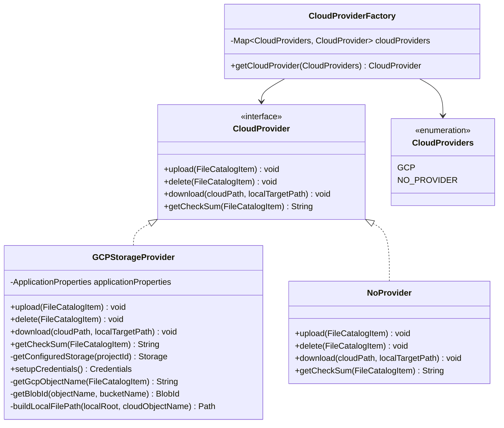
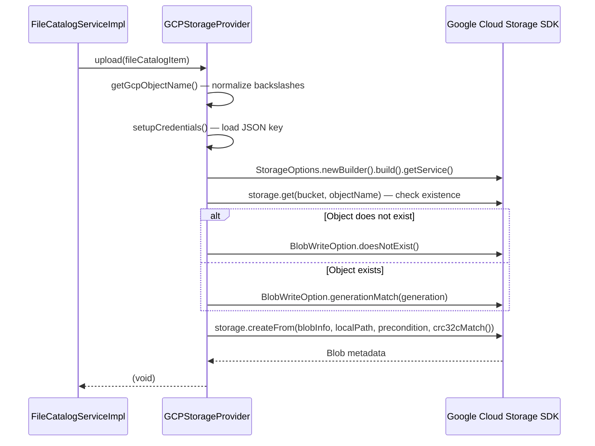

# Cloud Provider Abstraction

Cloud Archiver uses a strategy pattern to decouple the sync logic from any specific cloud vendor.

---

## Interface

---

## GCPStorageProvider

### Upload Flow

Key behaviors:
- **CRC32C integrity**: The SDK verifies the checksum on the server side (`crc32cMatch()`), rejecting corrupted uploads.
- **Race condition guard**: Generation-match precondition prevents overwriting a concurrently modified object.
- **Storage class**: Set per-object via `BlobInfo.setStorageClass()` if `storageClass` is configured; otherwise inherits the bucket default.
- **Path normalization**: Windows backslashes in `absolutePath` are converted to forward slashes for GCS object names.

### Download Flow

- If `cloudPath` ends with `/`, lists all blobs with that prefix and downloads each one.
- Otherwise downloads the single named object.
- Recreates the directory structure under `downloadRoot` using `buildLocalFilePath()`.

### Credentials

Loaded from a service account JSON key file at the path configured in `credentialsFilePath`. A new `Storage` client is constructed per operation (no connection pooling at the application level — the SDK handles this internally).

---

## NoProvider (Dry-Run)

`NoProvider` is the `@Primary` bean. It logs at `TRACE` level and performs no real I/O. Useful for:

- First-run validation — see what the application *would* do without incurring cloud costs.
- CI/CD testing without cloud credentials.
- Populating the MongoDB catalog before switching to a real provider.

> **Note:** `NoProvider.download()` throws `UnsupportedOperationException` — download is not supported in dry-run mode.

---

## Adding a New Provider

1. Implement `CloudProvider`.
2. Annotate with `@Component` and `@Qualifier("your_provider_name")`.
3. Add a value to the `CloudProviders` enum.
4. Register the new bean in `CloudProviderFactory`'s constructor.
5. Set `APPLICATION_CLOUDPROVIDERCONFIG_TYPE=YOUR_PROVIDER_NAME` in configuration.
