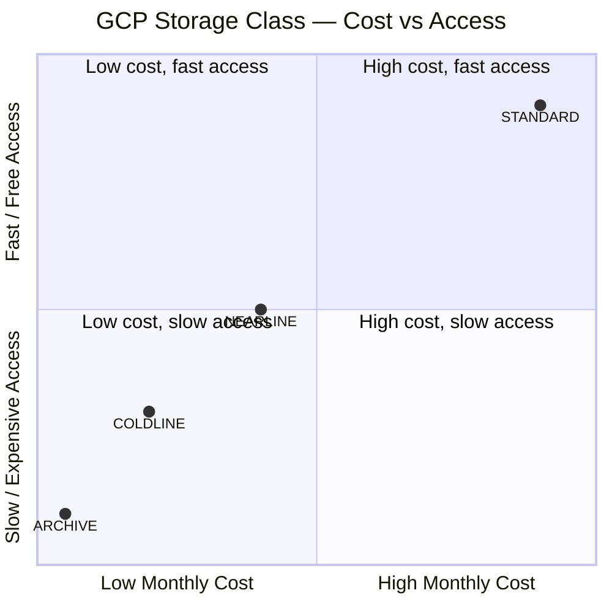

# Configuration Reference

All properties are bound under the `application.*` prefix via `@ConfigurationProperties`. In Docker, every property maps to an environment variable using Spring Boot's relaxed binding (dots → underscores, uppercase).

---

## Cloud Provider

| Property | Env var | Required | Description |
|----------|---------|----------|-------------|
| `application.cloudProviderConfig.type` | `APPLICATION_CLOUDPROVIDERCONFIG_TYPE` | yes | `GCP` or `NO_PROVIDER` |
| `application.cloudProviderConfig.projectId` | `APPLICATION_CLOUDPROVIDERCONFIG_PROJECTID` | yes (GCP) | GCP project ID |
| `application.cloudProviderConfig.bucketName` | `APPLICATION_CLOUDPROVIDERCONFIG_BUCKETNAME` | yes (GCP) | GCS bucket name |
| `application.cloudProviderConfig.credentialsFilePath` | `APPLICATION_CLOUDPROVIDERCONFIG_CREDENTIALSFILEPATH` | yes (GCP) | Path to service account JSON key |
| `application.cloudProviderConfig.storageClass` | `APPLICATION_CLOUDPROVIDERCONFIG_STORAGECLASS` | no | `STANDARD`, `NEARLINE`, `COLDLINE`, or `ARCHIVE`. Omit to use the bucket's default. |

### Storage Class Trade-offs



> For pure backup use cases, `ARCHIVE` gives the lowest monthly storage cost. Set `standardDeleteDaysLimit` and `archiveDeleteDaysHold` accordingly to avoid early-deletion fees.

---

## Scan Folders

Multiple folders can be configured. Each is independent and can have different retention and filtering rules.

| Property | Env var (index N) | Required | Default | Description |
|----------|-------------------|----------|---------|-------------|
| `scanFolders[N].scanFolder` | `APPLICATION_SCANFOLDERS_N_SCANFOLDER` | yes | — | Absolute path to scan |
| `scanFolders[N].cleanRemovedFromCloud` | `APPLICATION_SCANFOLDERS_N_CLEANREMOVEDFROMCLOUD` | no | `false` | Delete from cloud when file is removed locally |
| `scanFolders[N].ignoreHiddenFiles` | `APPLICATION_SCANFOLDERS_N_IGNOREHIDDENFILES` | no | `false` | Skip hidden files (dot-files on Linux) |
| `scanFolders[N].collectionFetchSize` | `APPLICATION_SCANFOLDERS_N_COLLECTIONFETCHSIZE` | no | `500` | MongoDB page size for catalog reads |
| `scanFolders[N].standardDeleteDaysLimit` | `APPLICATION_SCANFOLDERS_N_STANDARDDELETEDAYSLIMIT` | no | `null` | Days after upload during which deletion is free (Standard class window) |
| `scanFolders[N].archiveDeleteDaysHold` | `APPLICATION_SCANFOLDERS_N_ARCHIVEDELETEDAYSHOLD` | no | `null` | Additional days to hold after `standardDeleteDaysLimit` before deleting from cold storage |
| `scanFolders[N].ignorePatterns[M]` | `APPLICATION_SCANFOLDERS_N_IGNOREPATTERNS_M` | no | — | Java regex matched against `fileName` |

### Ignore Pattern Examples

| Pattern | Matches |
|---------|---------|
| `^\..+` | Any file starting with `.` (hidden files) |
| `^_.*` | Any file starting with `_` |
| `.+\.(mov\|PNG)$` | Files ending in `.mov` or `.PNG` |
| `^\/immich\/library\/donotsyncusername` | Specific user folder |

---

## Notifications (Discord Webhook)

| Property | Env var | Required | Description |
|----------|---------|----------|-------------|
| `application.notificationsConfig.uri` | `APPLICATION_NOTIFICATIONSCONFIG_URI` | no | Discord webhook URL |
| `application.notificationsConfig.userName` | `APPLICATION_NOTIFICATIONSCONFIG_USERNAME` | no | Display name in Discord |
| `application.notificationsConfig.summaryTemplateText` | `APPLICATION_NOTIFICATIONSCONFIG_SUMMARYTEMPLATETEXT` | no | Message template (see variables below) |
| `application.notificationsConfig.embedEnabled` | `APPLICATION_NOTIFICATIONSCONFIG_EMBEDENABLED` | no | `false` = plain text, `true` = rich embed |
| `application.notificationsConfig.infoPrefix` | — | no | Prefix for info messages (default: `INFO: `) |
| `application.notificationsConfig.errorPrefix` | — | no | Prefix for error messages (default: `ERROR: `) |

### Template Variables

| Variable | Replaced with |
|----------|--------------|
| `SCAN_LOCATION` | The scan folder path |
| `IMPORTED_COUNT` | Number of files uploaded |
| `IMPORTED_SIZE` | Human-readable upload size (e.g. `1.2 GB`) |
| `DELETED_COUNT` | Number of files deleted from cloud |
| `DELETED_SIZE` | Human-readable delete size |

Example template:
```
SCAN_LOCATION — uploaded IMPORTED_COUNT (IMPORTED_SIZE), deleted DELETED_COUNT (DELETED_SIZE)
```

---

## Scheduler

| Property | Env var | Default | Description |
|----------|---------|---------|-------------|
| `backup.schedule.cron` | `BACKUP_SCHEDULE_CRON` | `0 0 3/12 * * *` | Spring cron expression (every 12 h starting at 3 AM) |

---

## Other Settings

| Property | Env var | Default | Description |
|----------|---------|---------|-------------|
| `application.crc32cBufferSize` | `CRC32CBUFFERSIZE` | `1024` | Read buffer size (bytes) for CRC32C computation |
| `application.downloadRoot` | `APPLICATION_DOWNLOADROOT` | — | Local root directory for cloud downloads |
| `application.syncLockTimeoutSeconds` | — | `3600` | Seconds before a stale sync lock is force-released |

---

## MongoDB

| Property | Env var | Description |
|----------|---------|-------------|
| `spring.data.mongodb.database` | `SPRING_DATA_MONGODB_DATABASE` | Database name |
| `spring.data.mongodb.uri` | `SPRING_DATA_MONGODB_URI` | Connection string (supports Atlas SRV format) |

---

## Actuator / Observability

Exposed endpoints (configured in `application.yml`):

```yaml
management:
  endpoints:
    web:
      exposure:
        include:
          - prometheus
          - health
```

| Endpoint | URL |
|----------|-----|
| Health | `GET /cloud-archiver/actuator/health` |
| Prometheus metrics | `GET /cloud-archiver/actuator/prometheus` |
