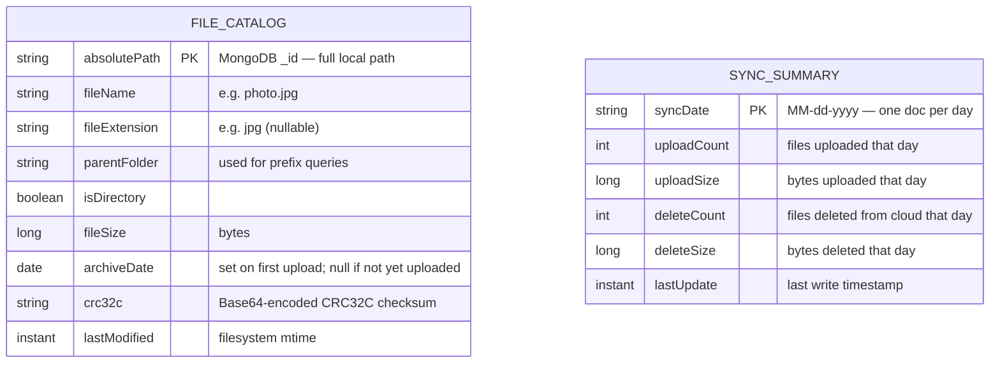
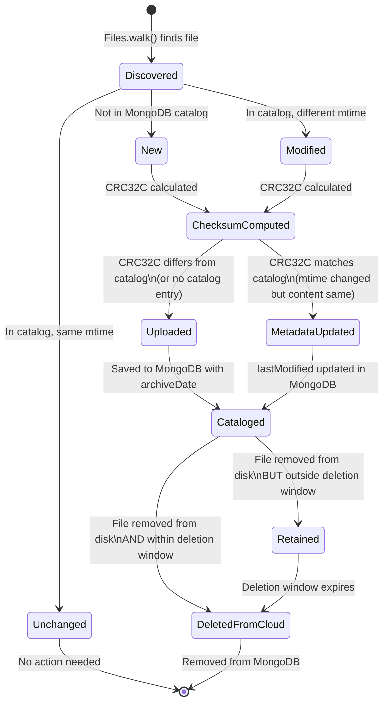

# Data Model

Cloud Archiver uses two MongoDB collections.

---

## Collections



---

## Response DTOs (not persisted)

### PendingDeletionItem

Returned by `GET /file-catalog/pending-deletion`. Wraps a `FileCatalogItem` with computed deletion metadata.

| Field | Type | Description |
|-------|------|-------------|
| `catalogItem` | `FileCatalogItem` | The full catalog entry from MongoDB |
| `daysUntilDeletion` | `long` | Days until eligible for cloud deletion. Negative = already overdue. `0` = eligible now or retention not configured. |
| `scanFolder` | `string` | The `scanFolder` of the owning `ScanLocationConfig` (longest prefix match). `"unknown"` if no location matches. |

**Eligibility formula:**
```
eligibleDate = archiveDate + standardDeleteDaysLimit + archiveDeleteDaysHold
daysUntilDeletion = eligibleDate - today
```

---

## FileCatalogItem — State Transitions



---

## Repository Query Reference

### FileCatalogItemRepository

| Method | Purpose |
|--------|---------|
| `findById(absolutePath)` | Exact lookup by full path |
| `findByFileNameContains(fileName)` | Case-sensitive substring search |
| `findByFileNameContainsIgnoreCase(fileName)` | Case-insensitive substring search |
| `findByParentFolderStartsWith(parentFolder, pageable)` | All files under a folder (paginated) |
| `findByParentFolderStartsWithAndArchiveDateAfterOrParentFolderStartsWithAndArchiveDateBefore(...)` | Cleanup query: files uploaded recently OR very old |
| `findByArchiveDateBetweenAndAbsolutePathStartsWith(start, end, path)` | Date-range search under a path |
| `findByArchiveDateBetween(start, end)` | Date-range search across all paths |
| `findByFileNameContainsIgnoreCase(fileName, pageable)` | Pending-deletion: case-insensitive substring, paginated |
| `findByFileName(fileName, pageable)` | Pending-deletion: exact name match, paginated |
| `findByFileNameContainsIgnoreCaseAndParentFolderStartsWith(fileName, parentFolder, pageable)` | Pending-deletion: substring + path prefix, paginated |
| `findByFileNameAndParentFolderStartsWith(fileName, parentFolder, pageable)` | Pending-deletion: exact name + path prefix, paginated |

### SyncSummaryRepository

Standard `MongoRepository<SyncSummaryItem, String>` — `findById(MM-dd-yyyy)` used to accumulate daily totals.
