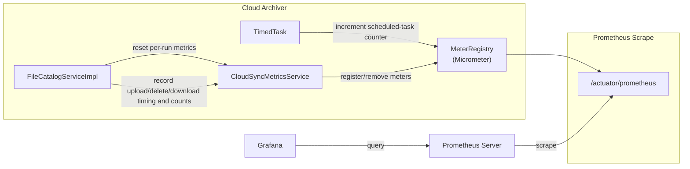

# Observability

Cloud Archiver exposes metrics via [Micrometer](https://micrometer.io/) and publishes them in Prometheus format at `/cloud-archiver/actuator/prometheus`.

Sync metrics are reset at the start of each full sync run, but metric ownership now lives in a dedicated `CloudSyncMetricsService`. That keeps prototype-scoped sync services from double-registering meters while still giving each run a clean set of counters and timers.

---

## Metrics Reference

| Metric name | Type | Description |
|-------------|------|-------------|
| `cloud_archiver_files_uploaded_total` | Counter | Files successfully uploaded to cloud during the current sync run |
| `cloud_archiver_files_deleted_total` | Counter | Files deleted from cloud during the current sync run |
| `cloud_archiver_upload_duration_seconds` | Timer | Per-file upload duration |
| `cloud_archiver_delete_duration_seconds` | Timer | Per-file delete duration |
| `cloud_archiver_scan_duration_seconds` | Timer | Total duration of one location sync |
| `cloud_archiver_files_in_catalog` | Gauge | Current count of documents in `file_catalog` |
| `cloud_archiver_gcp_downloads_total` | Counter | Cloud-to-local download operations |
| `cloud_archiver_gcp_upload_bytes` | DistributionSummary | Bytes uploaded per file |
| `cloud_archiver_gcp_download_bytes` | DistributionSummary | Bytes downloaded per file |
| `cloud_archiver_backup_task_runs_total` | Counter | Times the scheduled task has fired |

---

## Metrics Flow



---

## Logging and MDC

Cloud Archiver now uses a small MDC envelope for sync work:

- `syncRunId`: stable ID for one `startAllLocationSyncs()` invocation
- `scanLocation`: current scan folder while processing one location
- `syncPhase`: coarse phase such as `sync`, `backup`, `cleanup`, `summary`, or `download`

The context is opened at sync and download entrypoints, copied before `@Async` notification hops, and restored/cleared in `finally` blocks so stale values do not leak into later requests or scheduled runs.

### Logging guidance

- `INFO`: one line per high-level lifecycle event such as sync start, sync completion, backup completion, cleanup completion, and successful download
- `DEBUG`: batch sizes, cache sizes, and per-file upload intent when diagnosing issues
- `TRACE`: very noisy filtering/page-walk details only
- Avoid per-item success logs inside parallel streams unless they materially help diagnosis

---

## Health Check

```
GET /cloud-archiver/actuator/health
```

Returns Spring Boot's standard health response. Includes MongoDB connectivity status automatically via the `spring-boot-starter-data-mongodb` auto-configuration.

```json
{
  "status": "UP",
  "components": {
    "mongo": { "status": "UP" },
    "diskSpace": { "status": "UP" }
  }
}
```

---

## Thread-Safety Notes

- `FileCatalogServiceImpl` remains prototype-scoped, but mutable counters are per-instance and reset per location.
- Cleanup and metadata-save loops now use regular streams instead of `parallelStream()` to avoid racing Spring repositories and provider clients.
- Async webhook notifications snapshot the current MDC envelope before the thread hop, restore it inside the async sender, and always clear the thread-local state afterward.
