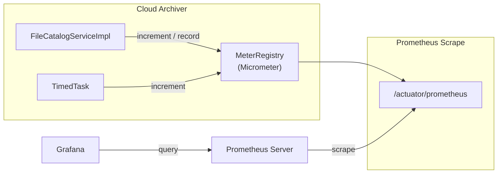

# Observability

Cloud Archiver exposes metrics via [Micrometer](https://micrometer.io/) and publishes them in Prometheus format at `/cloud-archiver/actuator/prometheus`.

Metrics are **reset at the start of each sync run** so they reflect the most recent execution.

---

## Metrics Reference

| Metric name | Type | Description |
|-------------|------|-------------|
| `cloud_archiver_files_uploaded_total` | Counter | Files successfully uploaded to cloud |
| `cloud_archiver_files_deleted_total` | Counter | Files deleted from cloud |
| `cloud_archiver_upload_duration_seconds` | Timer | Per-file upload duration |
| `cloud_archiver_delete_duration_seconds` | Timer | Per-file delete duration |
| `cloud_archiver_scan_duration_seconds` | Timer | Total duration of one location sync |
| `cloud_archiver_files_in_catalog` | Gauge | Current count of documents in `file_catalog` |
| `cloud_archiver_gcp_downloads_total` | Counter | Cloud-to-local download operations |
| `cloud_archiver_gcp_upload_bytes` | DistributionSummary | Bytes uploaded per file |
| `cloud_archiver_gcp_download_bytes` | DistributionSummary | Bytes downloaded per file |
| `cloud_archiver_backup_task_runs_total` | Counter | Times the scheduled task has fired |

---

## Metrics Flow



---

## Health Check

```
GET /cloud-archiver/actuator/health
```

Returns Spring Boot's standard health response. Includes MongoDB connectivity status automatically via the `spring-boot-starter-data-mongodb` auto-configuration.

```json
{
  "status": "UP",
  "components": {
    "mongo": { "status": "UP" },
    "diskSpace": { "status": "UP" }
  }
}
```

---

## Logging

Log levels are configured per package:

| Logger | Default level | Description |
|--------|--------------|-------------|
| `root` | `INFO` | All other libraries |
| `com.homelab.ringue` | `INFO` | Application code (`DEBUG` for verbose, `TRACE` for very noisy) |

Set via `LOGGING_LEVEL_COM_HOMELAB_RINGUE=DEBUG` in Docker to see per-file upload/delete details.
