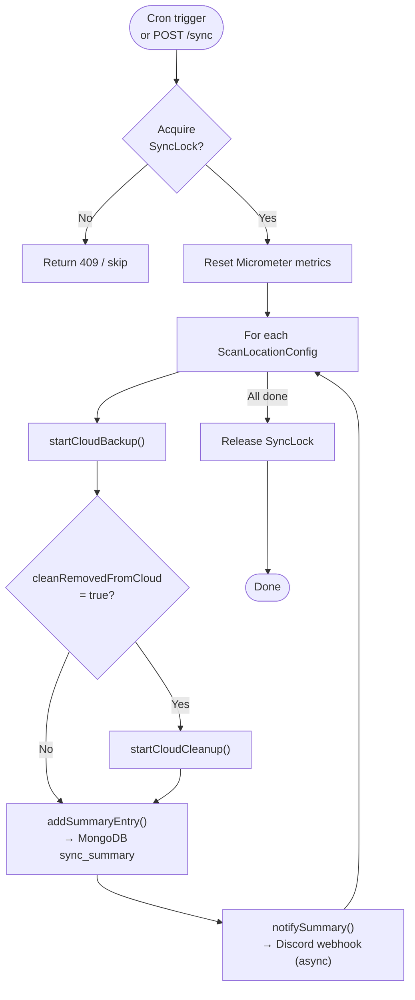
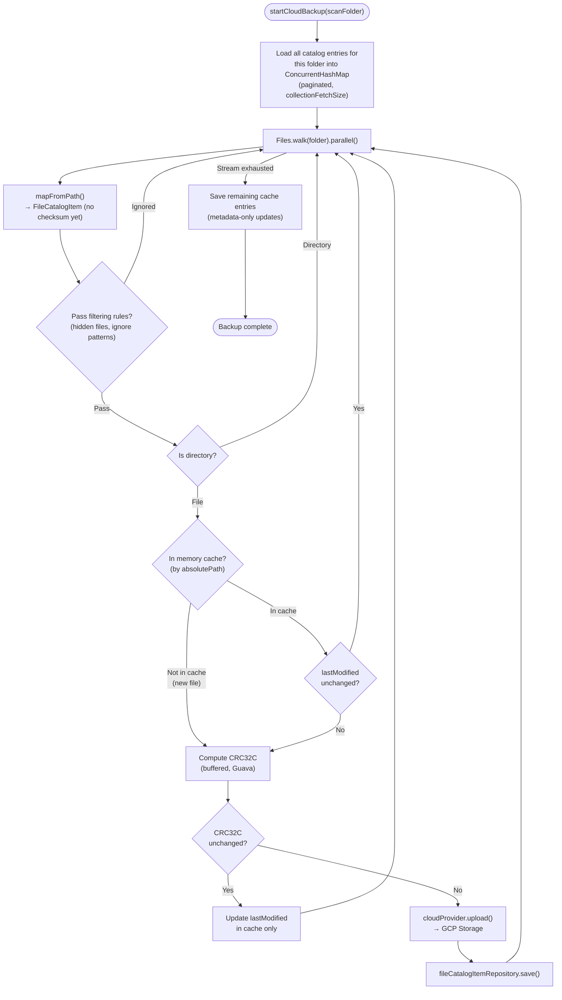
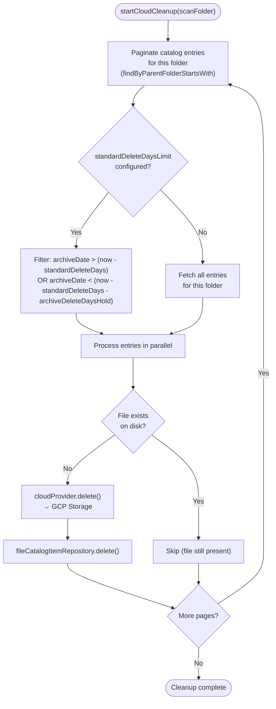
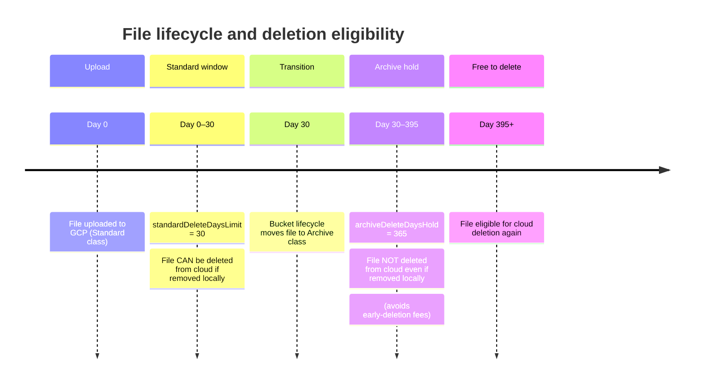
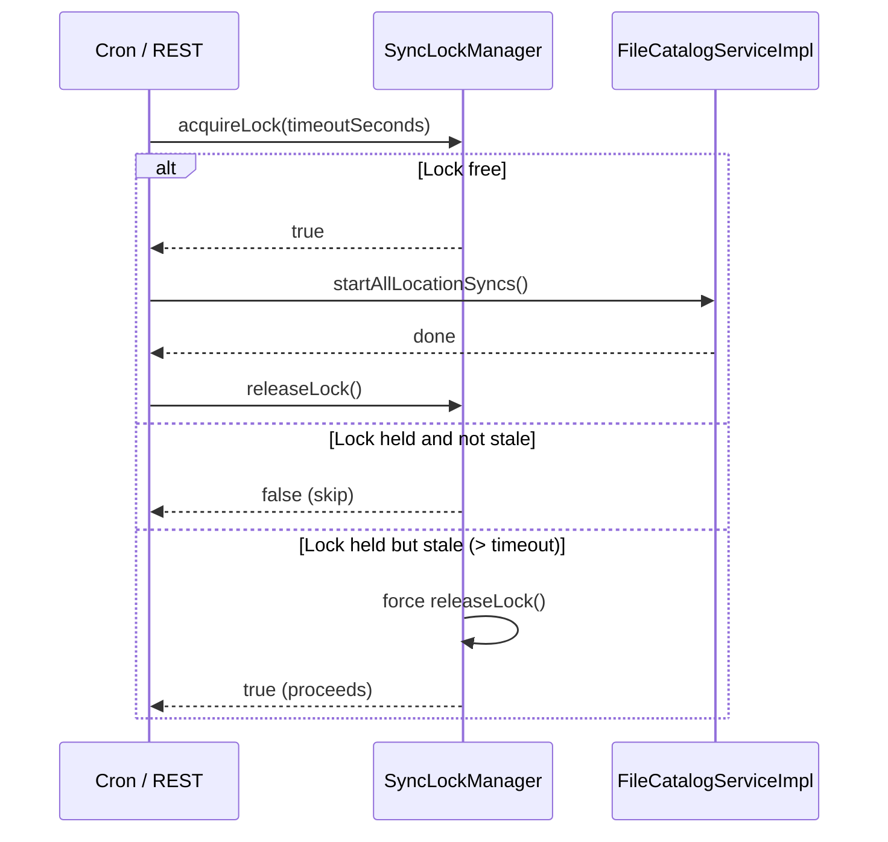

# Sync Workflow

## High-Level Flow

The sync process runs on a configurable cron schedule (default: 3 AM and 3 PM daily). It can also be triggered manually via the REST API. A `SyncLockManager` ensures only one sync runs at a time.

---

## Backup Phase Detail

For each configured scan folder, the service walks the filesystem and compares every file against the MongoDB catalog.

---

## Cleanup Phase Detail

The cleanup phase removes cloud objects for files that no longer exist on disk. It respects configurable retention windows to avoid early-deletion fees on cold storage classes (Nearline, Coldline, Archive).

### Retention Window Logic

---

## Concurrency Control

