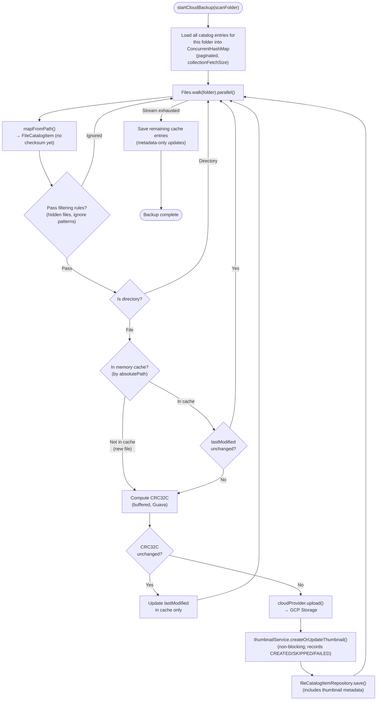
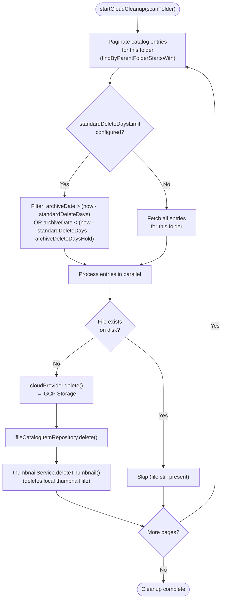
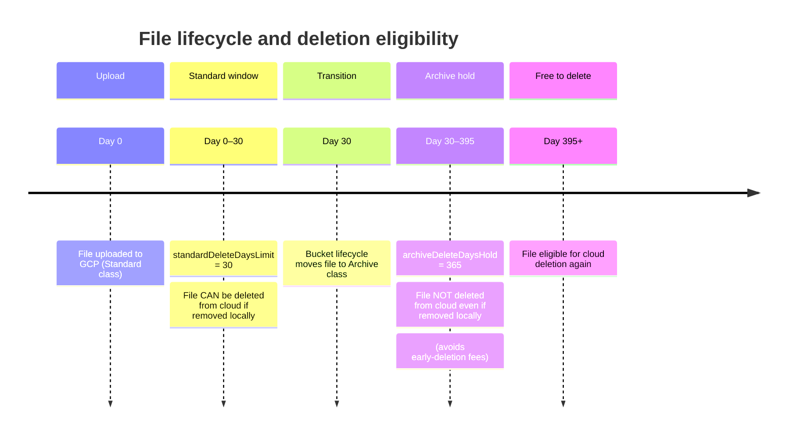
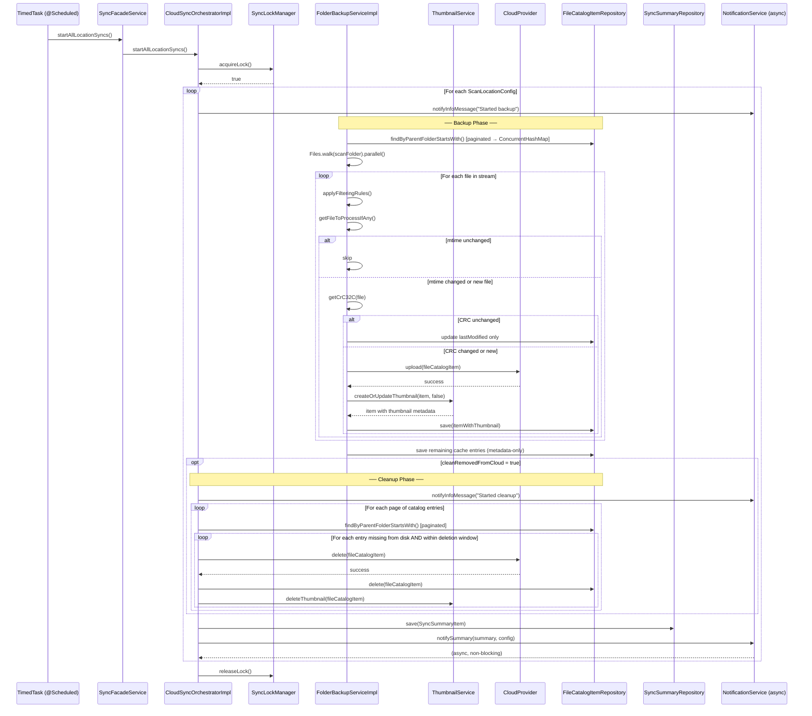
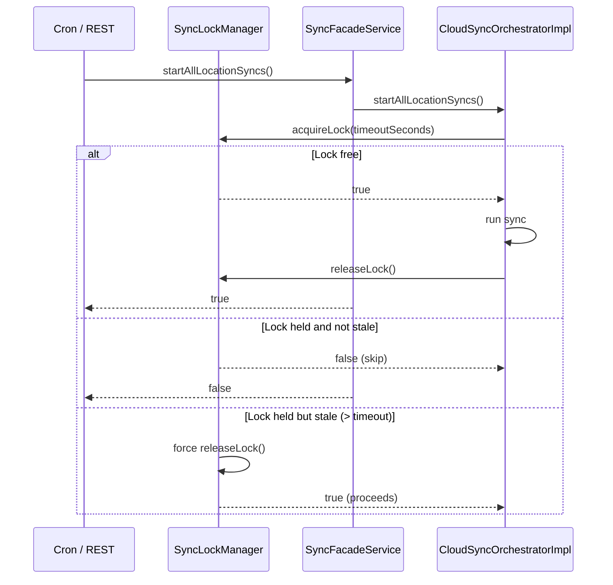

# Sync Workflow

## High-Level Flow

The sync process runs on a configurable cron schedule (default: 3 AM and 3 PM daily). It can also be triggered manually via the REST API. A `SyncLockManager` ensures only one sync runs at a time.

---

## Backup Phase Detail

For each configured scan folder, the service walks the filesystem and compares every file against the MongoDB catalog.

`FolderBackupServiceImpl` owns the scan/import pipeline: cache hydration, filtering, CRC32C decisions, upload execution, thumbnail creation, and metadata-only savebacks. After a successful upload, `ThumbnailService.createOrUpdateThumbnail()` is called immediately — the MongoDB save includes the thumbnail metadata in the same write. Thumbnail failures are non-blocking: they are recorded as `thumbnailStatus=FAILED` on the catalog item, and the upload is still counted as successful. Per-file upload decisions are wrapped in MDC fields (`scanFolder`, `filePath`, `backupDecisionId`) so structured logs survive the parallel stream fan-out without leaking context between files.

---

## Cleanup Phase Detail

The cleanup phase removes cloud objects for files that no longer exist on disk. It respects configurable retention windows to avoid early-deletion fees on cold storage classes (Nearline, Coldline, Archive).

### Retention Window Logic

---

## Detailed Sequence Diagram

This captures the full participant interaction across both backup and cleanup phases.

---

## Concurrency Control

