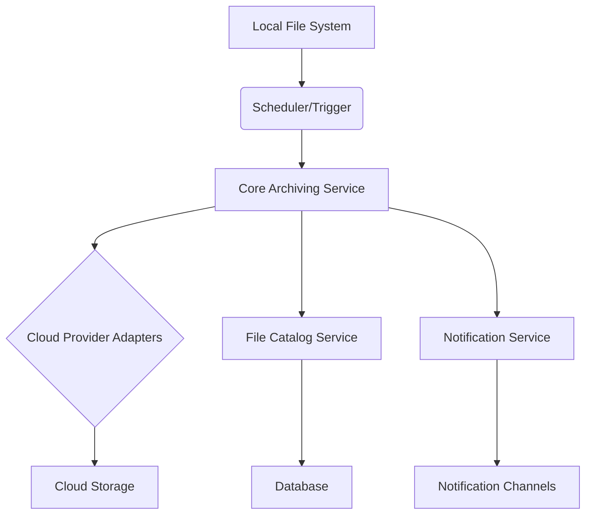

# System Patterns: Cloud Archiver

## System Architecture

The Cloud Archiver is designed as a modular, event-driven application. It follows a microservices-oriented approach, though initially, components might be co-located within a single application. A detailed workflow of the sync process is available in `docs/sync_workflow.md`.

- **Core Archiving Service:** Handles the primary logic of scanning, uploading, and managing files.
- **File Catalog Service:** Manages the metadata of archived files in a persistent store (e.g., MongoDB).
- **Cloud Provider Adapters:** Abstract the specifics of different cloud storage APIs, allowing for easy integration of new providers.
- **Notification Service:** Decoupled service for sending alerts and updates.
- **Scheduler/Trigger:** Initiates archiving tasks based on configured schedules or events.

## Key Technical Decisions

- **Language & Framework:** Java with Spring Boot for robust, scalable, and maintainable backend services.
- **Database:** MongoDB for flexible schema and efficient storage of file metadata.
- **Cloud Integration:** Utilize official SDKs for cloud providers to ensure reliability and security.
- **Concurrency:** Employ asynchronous processing and thread pools for efficient file operations.
- **Configuration Management:** Externalized configuration (e.g., `application.yml`, environment variables) for easy deployment and management.

## Design Patterns in Use

- **Strategy Pattern:** For `CloudProvider` implementations, allowing easy swapping of cloud storage backends.
- **Factory Pattern:** `CloudProviderFactory` to create instances of specific `CloudProvider` implementations.
- **Repository Pattern:** For `FileCatalogItem` and `SyncSummary` data access.
- **Observer Pattern:** For the `NotificationService`, allowing multiple notification channels to subscribe to events.
- **Singleton Pattern:** Potentially for configuration beans or utility classes where a single instance is sufficient.

## Component Relationships

- `Core Archiving Service` depends on `File Catalog Service`, `Cloud Provider Adapters`, and `Notification Service`.
- `Cloud Provider Adapters` depend on specific cloud SDKs.
- `File Catalog Service` depends on the `FileCatalogItemRepository`.
- `Notification Service` depends on various notification channel implementations.

## Critical Implementation Paths

- **File Scanning and Hashing:** Efficiently identify new/modified files and generate unique hashes (e.g., SHA-256) for integrity checks.
- **Resumable Uploads:** Implement mechanisms for resuming large file uploads in case of network interruptions.
- **Error Handling & Retries:** Robust error handling with exponential backoff for transient cloud API failures.
- **Concurrency Control:** Manage concurrent file operations to prevent resource exhaustion and ensure data consistency.
- **Metadata Synchronization:** Ensure the file catalog accurately reflects the state of files in cloud storage.
